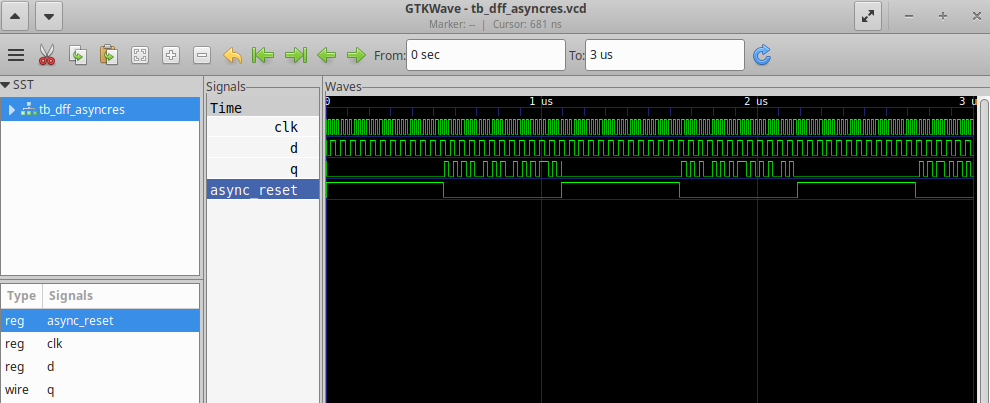
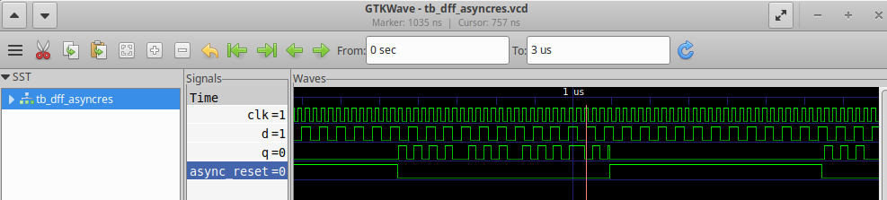
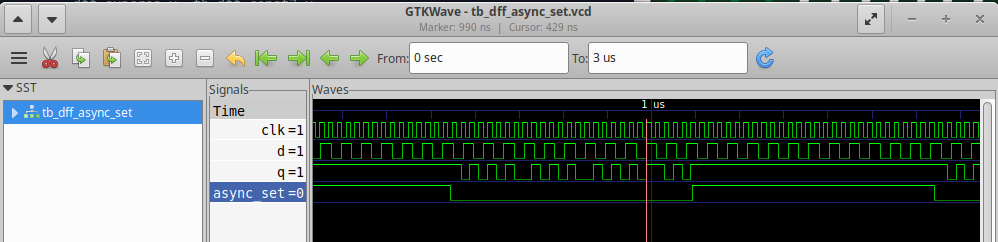
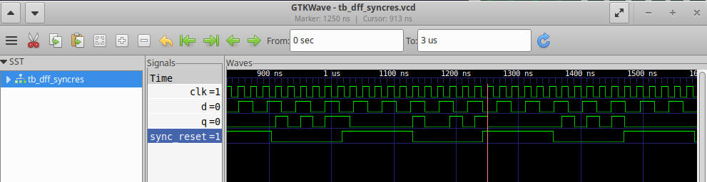
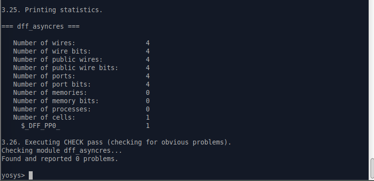
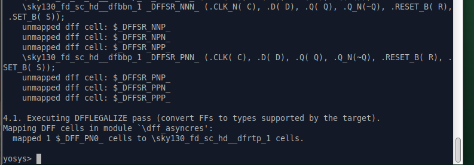
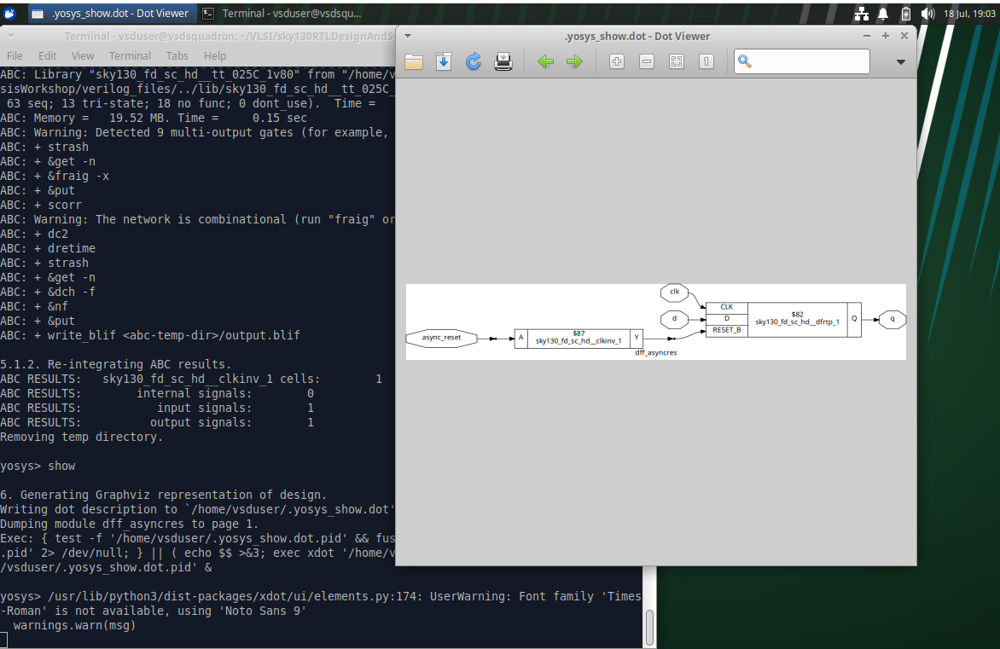
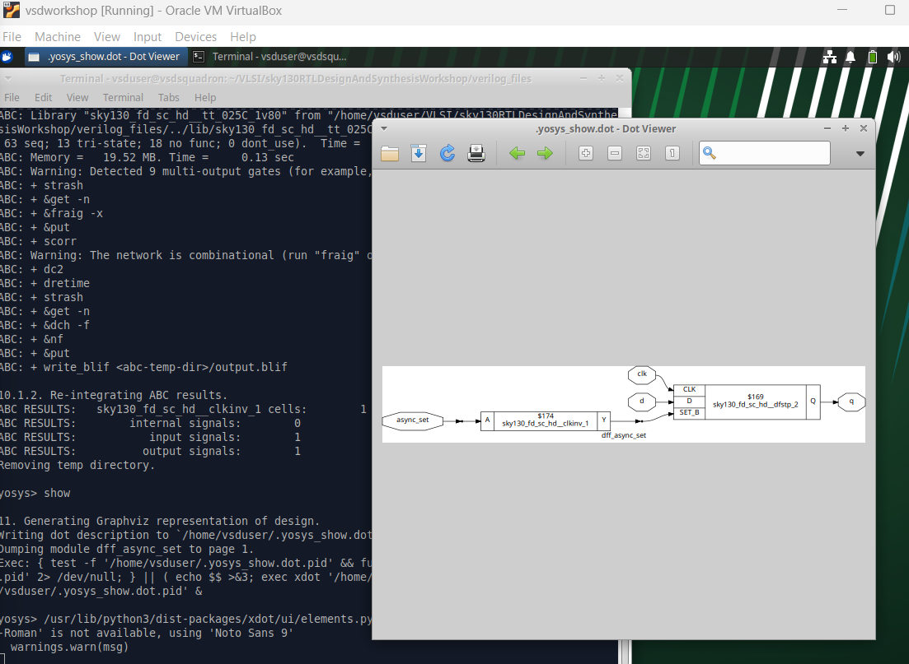
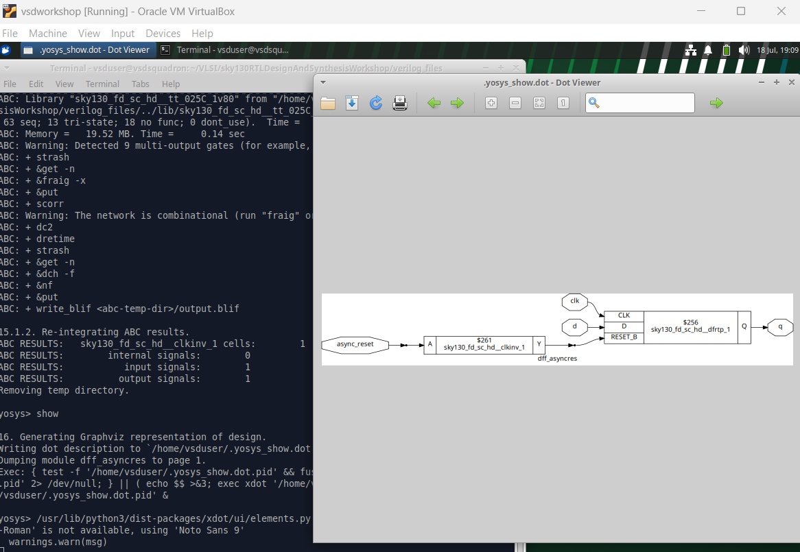
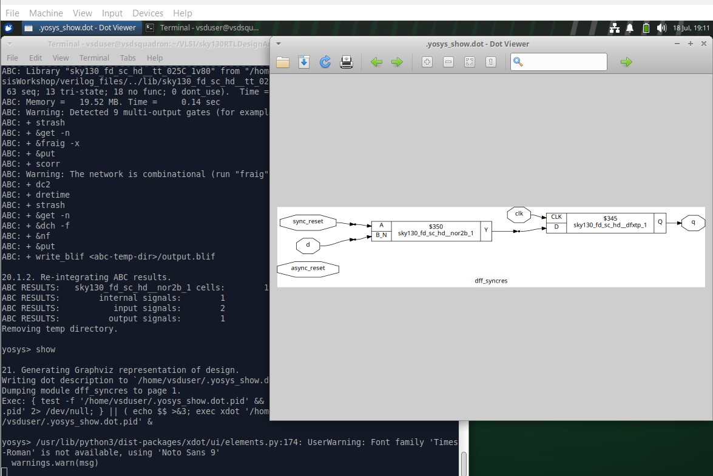

# Day 2 - Timing Libs, Synthesis and Flops

## Flops

Why flops? ==> to avoid glitches in combinational/sequential circuits by shielding unnecessary transition via restricting output change to clock edge.
### Coding styles
* Async reset => irrespective of clock and the rst needs to be mentioned in sensitivity list of the module.
* Sync reset => wait for clock

back to flops lab

* Img02 is of async reset where q is only changing on clock because of d

* Img03 also contributes.

* Img04 is of async set where q doesnt wait for clock

* Img05 is for sync reset where we wait for clock edge and for q to go low

* Img06 is the yosys synth of dff_asyncres

* Img07 is the out of dfflibmap for the same

* Img08 is the out of abc and show. We see that to link active high reset and active low reset, we have clock inverter in show.

* Img09 is the out of abc and show of set flop

* Img10 is the out of abc and show of asyncres.v

* Img11 is the out of abc and show of syncres.v. Here we see there is no set and reset pin.

